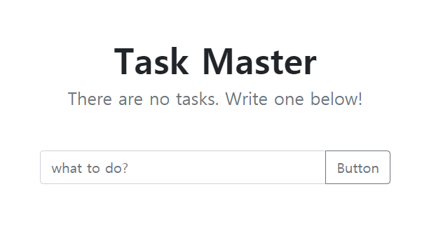

# flask-Todo
> simple Todo list with python - Flask 
> like... `Hello, World`...

### instructions
In local machine, I suggest using `vnev`
~~~
sudo apt update 
sudo apt upgrade
sudo apt install python3-pip
pip3 install -r requirements.txt
python3
>from app import db
>db.create_all()
python3 app.py
~~~
